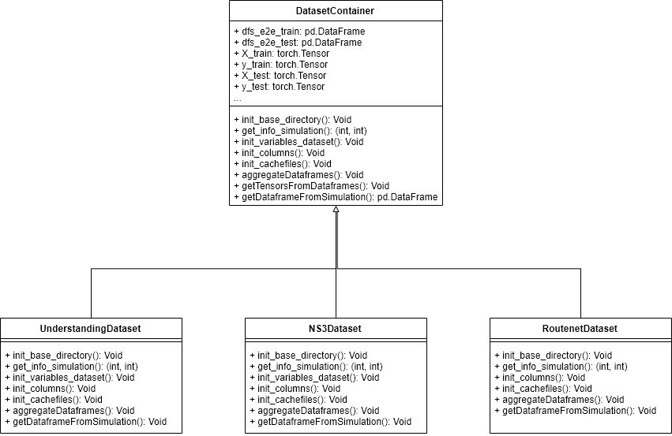

# Overview
This repository contains the code that allows to train, test and validate models based on [scikit-learn's random forest](https://scikit-learn.org/stable/modules/generated/sklearn.ensemble.RandomForestRegressor.html) and neural networks ([pytorch](https://pytorch.org/)). It is to be properly combined with [the repository related to datasets](http://rnd-gitlab-eu.huawei.com/network-optimisation/supervised-learning-qos-simulations). The repository contains two different programs:
* **dataset**: it requires a set of datasets as provided in [Routenet (https://github.com/knowledgedefinednetworking/Unveiling-the-potential-of-GNN-for-network-modeling-and-optimization-in-SDN/)](https://github.com/knowledgedefinednetworking/Unveiling-the-potential-of-GNN-for-network-modeling-and-optimization-in-SDN/), [Understanding (https://arxiv.org/pdf/1807.08652.pdf)](https://arxiv.org/pdf/1807.08652.pdf) or those obtained from the [ns3 simulations](http://rnd-gitlab-eu.huawei.com/network-optimisation/supervised-learning-qos-simulations). This code is in the libs directory, and consists mainly of the classes [DatasetContainer](http://rnd-gitlab-eu.huawei.com/network-optimisation/supervised-learning-qos-learning/blob/master/libs/dataset_container.py), [RoutenetDataset](http://rnd-gitlab-eu.huawei.com/network-optimisation/supervised-learning-qos-learning/blob/master/libs/routenet_dataset.py), [UnderstandingDataset](http://rnd-gitlab-eu.huawei.com/network-optimisation/supervised-learning-qos-learning/blob/master/libs/understanding_dataset.py) and [NS3Dataset](http://rnd-gitlab-eu.huawei.com/network-optimisation/supervised-learning-qos-learning/blob/master/libs/ns3_dataset.py). It provides the dataframes for training or testing or the pytorch tensors, depending on the algorithm that uses them.
* **training**: regardless from the algorithm, searches in a set of hyperparameters H, each of which is characterized by a discrete or continuous domain, selects the one providing best results in the validation set with crossvalidation and provides test results on the selected model.

For a simple use, stick to the following steps to be able to run this code with the already generated datasets.

1. Pull the [the repository related to datasets](http://rnd-gitlab-eu.huawei.com/network-optimisation/supervised-learning-qos-simulations)
2. Fix dependency with the machine, i.e., directory describing the root folder. **MUST** be the same of the dataset one. Change variable _dir_datasets_ in the corresponding [DatasetContainer](http://rnd-gitlab-eu.huawei.com/network-optimisation/supervised-learning-qos-learning/blob/master/libs/dataset_container.py). The variable is always in the function _init_base_directory_ but it is overwritten for each subclass of DatasetContainer.
3. If your dataset folder doesn't contain any dataset, either download the [dataset folder]() or generate the simulations.
4. Install the dependencies from requirements.txt, together with [pytorch](https://pytorch.org/). Regarding this last one, for any problem related to installation refer to the quick start. The code is built to run on CPU, and the porting to GPU is up to the user.
4. Execute the learning code as explained in the RF / NN part.

# Dataset container
Abstract class defining the normal procedure to import the raw data and build the datasets. It sequentially does the following:

1. initializes directory variables. **Must** be changed as it contains the information regarding the base directory of the datasets.
2. initializes information regarding the simulation, i.e, num_periods and num_nodes
3. initializes variables related to the subclass (need overriding of init_variables_dataset)
4. computes, if required, adjacency and spectral convolution matrix
5. initializes columns for raw data, dataframes (i.e., input for RF), tensors
6. initializes files related to cache
7. builds (from cache or raw data) dataframes and eventually write them to cache
8. builds tensors (from cache or raw data)

An UML representing the structure is the following:



**UML** representing dataset container. Have a look here to see which functions each class overrides.

In the next subparagraphs you can find some details on the inheriting classes.

## NS3 Dataset
D = F(T, C), being D = delay matrix, T = features extracted from traffic matrix, C capacity vector.
Given a window size W, the rolling mean, std and quantiles is computed for each OD flow in the traffic matrix to obtain these features (lag = 1).

## Routenet Dataset
D = F(T), being D = delay matrix, T = traffic matrix.

## Understanding Dataset
D = F(T), being D = delay matrix, T = traffic matrix.

Everytime a dataset container is executed and asked to combine the data to build a unique dataset for a scenario, both tensors and dataframes are associated to a cache directory, that will speedup an eventual next execution avoiding this part.

# Models
The current implementation expects a fixed topology. The scenarios on which we want to learn **in the ns3 dataset** can be different, and are identified to the Scenario enum in [NS3Dataset](http://rnd-gitlab-eu.huawei.com/network-optimisation/supervised-learning-qos-learning/blob/master/libs/ns3_dataset.py). Regardless from the model, it is possible to switch the scenario by changing the *scenario* variable. Each scenario differs to the other basically on how we split train and test sets. It follows a brief explanation on each possible scenario instance. Given a topology, routing is always fixed.
1. LEVEL_1: fixed an environment (i.e., a topology and a network, so fixed distribution of both capacities and propagation delays), try to generalize the prediction of the delay in case of unseen traffic. The traffic distribution varies with the intensity. For each intensity, we define a traffic rate distribution and draw S traffic rates matrices. The test dataset is made of unseen traffic rates matrices.

2. LEVEL_2: fixed a topology, fixed a propagation delay distribution, we consider different capacities distribution, and split traffic in the same way as in 1.

3. LEVEL_3: fixed a topology, we consider different propagation delay and capacity distributions. Test is made of traffic generated under different propagation delay and capacity distributions.

In both cases, the user can configure at execution time the following parameters:
1. Cache directory: name of directory where to cache the combined datasets
2. Dataset name: ns3 | understanding | routenet
3. Model name: name of the model. It is important to identify the directory where to save the model and the score
4. Topology: name of the directory, associated to a topology, containing the datasets (eg: abilene, nsf, ...)
5. Identifier: only for ns3. It allows to select to which simulation (i.e., execution of generate_simulations.py) we refer to
6. Intensity: only for ns3. If the user assigns "only_low" to this parameter, only one intensity (the lowest one) is considered
7. Test less intensities (bool): only for ns3. Whether to assign all the intensities to test or not. Default: False, and only three intensities are considered in test.
8. Scenario: only for ns3. Integer defining the scenario. 1, 2 or 3 to identify, respectively, level_1, level_2 or level_3.

General command for RF and NN:
```shell
python <script> <cache> <dataset> <model> <topology> <identifier> <intensity> <less_intensities> <scenario>
```

Once the dataset is loaded, the model is ran with cross validation and the best model with the relative score on the test dataset are output in the _model name_ directory.

## [Random Forest](http://rnd-gitlab-eu.huawei.com/network-optimisation/supervised-learning-qos-learning/blob/master/random%20forest/rf.py)
General command:
```shell
python rf.py <cache> <dataset> <model> <topology> <identifier> <intensity> <less_intensities> <scenario>
```
Example:
```shell
python rf.py cache_v1 ns3 rf_v1 abilene v1_fixed_capacity all True 1
```

### Details on implementation
The script will:
1. build the dataset and split it into train and test according to the input scenario. In case of ns3 dataset, the dataset is related to the _<identifier>_ simulation ran on the given topology
2. execute a RandomizedSearch with KFold CV (change hyperparameters if needed). A RandomizedSearch needs K = number of cross validations and S = number of different hyperparameter combinations attempt
3. select the best model from RandomizedSearch and test it
4. best model is output in  _base_dir_proj_/exported/crossvalidation/, together with the score. Model name is **random_forest.model**, scores goes under **scores.txt**

## [Multilayer perceptron](http://rnd-gitlab-eu.huawei.com/network-optimisation/supervised-learning-qos-learning/blob/master/pytorch/nn_cv.py)
The script will:
1. build the dataset and split it into train and test according to the input scenario. In case of ns3 dataset, the dataset is related to the _<identifier>_ simulation ran on the given topology
2. execute a GridSearch with CV (change hyperparameters if needed). The GridSearch needs the entire space of exploration and tries K times each combination
3. select the best model from GridSearch and test it
4. best model is output in  _base_dir_proj_/exported/crossvalidation/, together with the score. Model name is **NN.model**, scores (all of them!) go under **r2_test_scores.txt**. For each search, we provide the best model inside the corresponding directory, and results and model for each CV execution.
